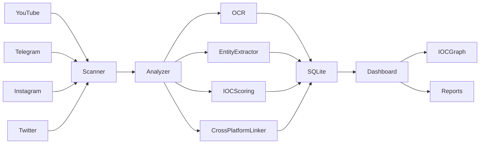

# Social-Scam-Monitor

An OSINT-based scam detection and threat intelligence platform that collects content from social media platforms, analyzes suspicious activity, extracts Indicators of Compromise (IOCs), performs OCR-based video investigation, and visualizes findings through an interactive dashboard.

---

## Features

### Data Collection

* YouTube content collection
* Telegram channel monitoring
* Instagram collector (experimental)
* Twitter collector (experimental)

### Scam Detection

* Gambling and betting scam detection
* Investment fraud detection
* Ponzi and pyramid scheme detection
* Hacking-related content detection
* Suspicious financial activity identification

### IOC Extraction

* Phone numbers
* UPI IDs
* Email addresses
* URLs
* Domains
* Telegram usernames
* Telegram links
* Cryptocurrency wallet addresses

### Video Analysis

* OCR-based frame analysis
* Detection of hidden phone numbers
* Detection of hidden payment information
* Scam keyword identification in videos

### Threat Intelligence

* IOC Reputation Scoring
* Cross-platform correlation
* Entity tracking
* Investigation support

### Dashboard

* Risk distribution
* Platform statistics
* IOC reputation table
* IOC relationship graph
* Investigation summaries

---

## Architecture



## Project Structure

```text
Social-Scam-Monitor
│
├── collectors/
├── analyzers/
├── dashboard/
├── logs/
├── output/
├── main_scanner.py
└── README.md
```

## Installation

```bash
git clone https://github.com/USERNAME/Social-Scam-Monitor.git

cd Social-Scam-Monitor

python3 -m venv venv

source venv/bin/activate

pip install -r requirements.txt
```

## Usage

Run scanner:

```bash
python main_scanner.py
```

Run dashboard:

```bash
python dashboard/app.py
```

Open:

```text
http://localhost:5000
```

## Screenshots

### Dashboard Overview

Add screenshot here

### IOC Reputation Table

Add screenshot here

### IOC Relationship Graph

Add screenshot here

## Current Capabilities

* Social media monitoring
* Scam detection
* IOC extraction
* OCR video investigation
* Threat intelligence enrichment
* Cross-platform correlation
* Interactive dashboard

## Future Enhancements

* VirusTotal integration
* URL reputation checking
* Real-time monitoring
* Threat feed integration
* Automated alerting
* PDF investigation reports

## Disclaimer

This project is intended for educational, research, and defensive cybersecurity purposes only.
